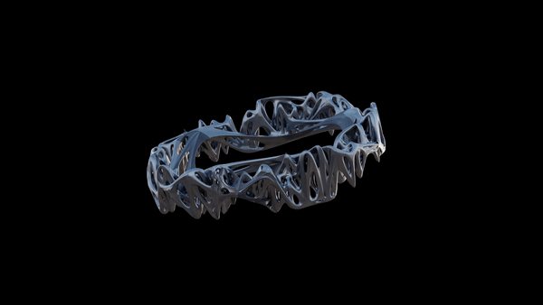
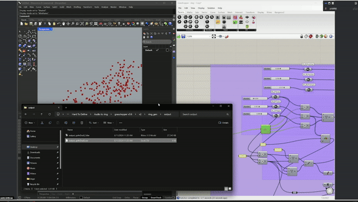
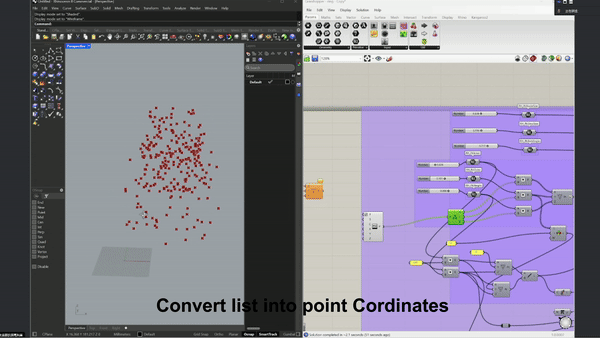
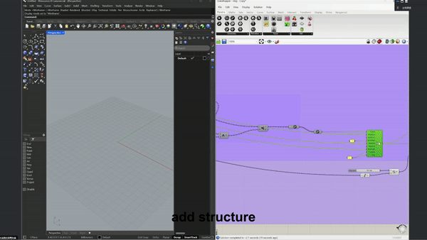
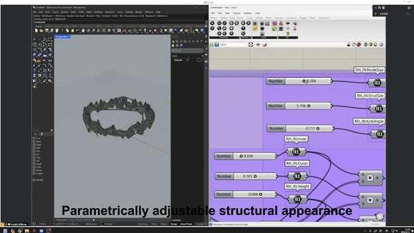
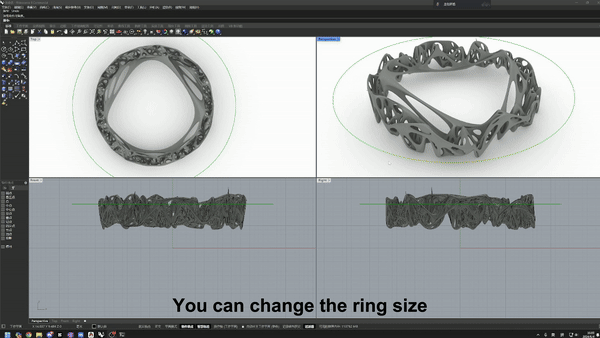

# **INFO-RING**



"Some ideas are formed by the combination of simple thoughts, which I call complex; examples include beauty, gratitude, human, army, universe, and so on."——John Locke   An Essay Concerning Human Understanding

## Description
 My recent research aims to delve into the intricate interplay between "collective memory" and 
"personal consciousness" within the context of complex systems research, utilizing artistic practice. I particularly focus on the complex connections between personal memory, emotions, and consciousness within the framework of collective memory.

 This framework not only helps decipher the complexity of events and phenomena that resonate with me personally but also serves as a lens through which I endeavor to understand the dynamic relationship between overall collective narratives and individual experiences. It reveals how we express these grand narratives through the prism of personal emotions, memories, and consciousness.

 In this specific case, we can simply summarise this transformation as, ```"How do you record a two-dimensional message with a three-dimensional object? / multidimensional information?"```

 I try to discuss whether being in a three-dimensional environment makes it impossible for us to comprehend higher-dimensional phenomena.？
 
 Furthermore, if we attempt to define things beyond three dimensions using mathematical formulas within (at most) three dimensions, would we never be able to fully and accurately convert and record the original information?
 
## Why 
Many times I would feel fuzzy and dizzy in my head. I feel as if I can't understand much of what's going on around me, and I'm looking at a lot of sights through a hair glass. I can feel that I'm close to them and it seems so far away. So I try to picture it in words, but it seems difficult.
It's as if I've poured out all the words, all the combinations of intonation that I can muster to express even a moment of what's going on in my head.


So I guess language and words are just a downgrading of our feelings and thoughts, the result of visualising and hearing these higher dimensions, more complex and seemingly chaotic thoughts.Once you describe them in words, it is mapped into something more concrete, describable, visible and tangible. Our brains can then understand it, remember it, and develop it.


The same is true for many things, after translating a higher dimensional thing with a set of things, in this case especially when translated into a three dimensional object (the real object is in the same dimension as us). We are able to record, understand, feel, remember and develop its concepts more directly.

We want to creative a code and visualised way to grasp the more complex, abstract, something akin to emotions that are generally difficult to articulate to a solid work.


## About algorithms

It’s worth noting that this algorithm is just a simple example to demonstrate the idea and it won’t be the final version. In future versions, I will try to implement more complex algorithms to increase information density and endurance.











